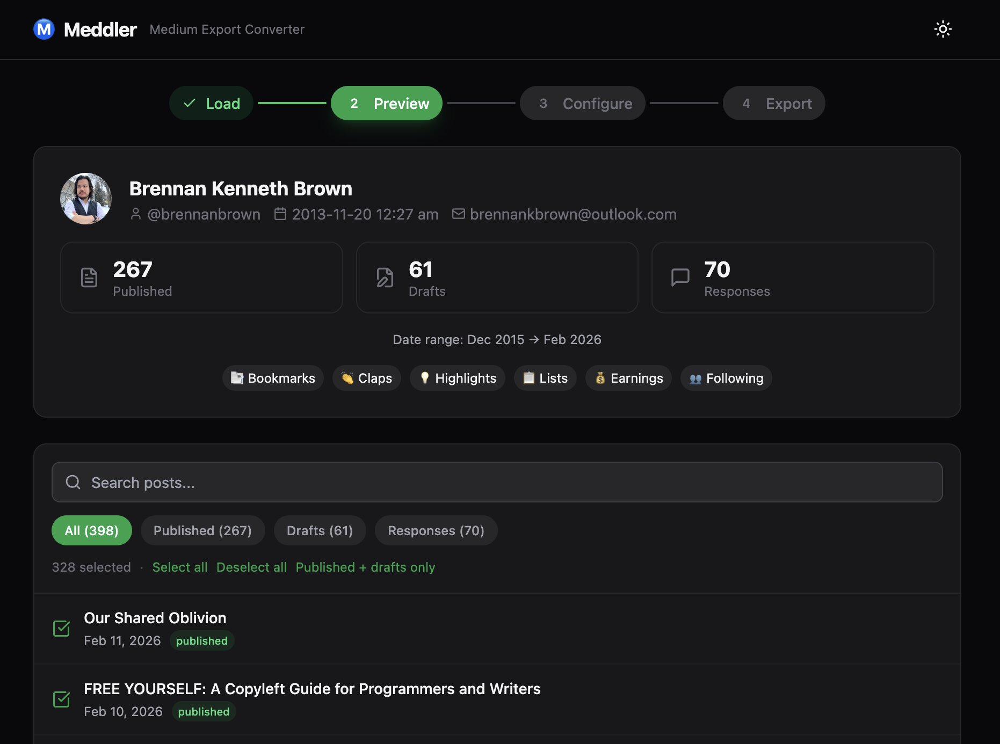

# Ⓜ️ Meddler

[](https://www.npmjs.com/package/meddler-cli)
[](https://app.netlify.com/projects/meddler/deploys)
[](https://opensource.org/licenses/AGPL-3.0)
[](https://nodejs.org/)
[](https://www.typescriptlang.org/)

Ⓜ️ Convert your Medium export to Markdown with front matter for Hugo, Eleventy, Jekyll, Astro, and more.

Meddler helps you reclaim your content from Medium and convert it to static site generator formats. It preserves your posts, drafts, responses, and supplementary data while adding rich metadata like earnings, reading time, and tags.

📖 **[View CLI Documentation](https://meddler.fyi/docs)** — Complete reference for all command-line options and configuration.



## Features

- **Multiple Output Formats**: Markdown, HTML, JSON
- **SSG Support**: Hugo, Eleventy, Jekyll, Astro with per-target defaults
- **Rich Front Matter**: YAML, TOML, or JSON with comprehensive metadata
- **Content Options**: Preserve or remove images, embeds, footnotes
- **Supplementary Data**: Export profile, publications, lists, bookmarks, claps, earnings
- **Privacy-First**: Web version runs entirely in your browser
- **CLI & Web**: Use command-line or web interface

## Installation

### CLI (Recommended for power users)

```bash
npm install -g meddler-cli
```

### Web (No installation required)

Visit [meddler.fyi](https://meddler.fyi) to use the web version directly in your browser.

## Quick Start

### CLI

```bash
# Convert with default settings (generic target + YAML + Markdown)
meddler medium-export.zip

# Specify output directory
meddler medium-export.zip -o my-site

# Target Eleventy
meddler medium-export.zip --target eleventy

# Custom configuration
meddler medium-export.zip \
  --format toml \
  --target astro \
  --output-format html \
  --responses
```

### Web

1. Go to [meddler.fyi](https://meddler.fyi)
2. Drag and drop your Medium export ZIP file
3. Configure your conversion settings
4. Download the converted ZIP

## What Gets Converted

### Content
- ✅ Published posts
- ✅ Drafts (optional)
- ✅ Responses (optional)
- ✅ Images (downloaded or referenced)
- ✅ Embeds (preserved or cleaned)

### Metadata
- ✅ Title, subtitle, slug
- ✅ Publication date
- ✅ Tags and topics
- ✅ Earnings data (from Partner Program, opt-in)
- ✅ Author information

### Supplementary Data
- ✅ Author profile
- ✅ Publications
- ✅ Lists
- ✅ Bookmarks
- ✅ Claps
- ✅ Followers/following data

## Configuration

### Front Matter Formats

**YAML** (default):
```yaml
---
title: "My Post"
date: "2024-01-01"
tags: ["tag1", "tag2"]
earnings: 12.34
---
```

**TOML**:
```toml
+++
title = "My Post"
date = "2024-01-01"
tags = ["tag1", "tag2"]
earnings = 12.34
+++
```

**JSON**:
```json
{
  "title": "My Post",
  "date": "2024-01-01",
  "tags": ["tag1", "tag2"],
  "earnings": 12.34
}
```

### SSG Targets

| SSG | Front Matter | Content Dir | Notes |
|-----|--------------|-------------|-------|
| Generic | YAML | `posts/` | Default |
| Hugo | TOML | `content/posts/<slug>/index.md` | Page bundles, shortcode embeds |
| Eleventy | YAML | `posts/` | Pair with `--unquoted-dates` |
| Jekyll | YAML | `_posts/YYYY-MM-DD-slug.md` | Drafts go to `_drafts/` |
| Astro | YAML | `src/content/posts/` | |

## Advanced Options

### CLI Flags

```bash
# Output format
--output-format markdown|html|structured-json

# Front matter
--format yaml|toml|json|none

# Target SSG
--target generic|hugo|eleventy|jekyll|astro

# Content filtering
--no-drafts            # Exclude draft posts (included by default)
--responses            # Include response posts
--images reference|download|optimize
--embeds raw_html|shortcodes|placeholders

# Supplementary data
--no-supplementary     # Skip bookmarks, claps, profile, etc.
--include-all          # Include sessions, IPs, blocks

# Front matter extras
--earnings             # Inject Partner Program earnings
--unquoted-dates       # Bare dates for Eleventy
--rewrite-image-urls   # Rewrite Medium CDN URLs to local paths
--image-base-url /images

# Utility
--dry-run
--verbose
```

## Web Interface

The web version provides the same functionality as the CLI with a user-friendly interface:

- **Step 1**: Upload your Medium export (ZIP or folder)
- **Step 2**: Preview posts, filter, and select what to convert
- **Step 3**: Configure all options with live preview
- **Step 4**: Export with progress tracking

All processing happens in your browser - your files never leave your device.

## Output Structure

For the default `generic` target (other targets use their conventional layouts):

```
meddler-output/
├── posts/
│   ├── my-post.md
│   └── another-post.md
├── drafts/
│   └── draft-post.md
├── data/
│   ├── author.json
│   ├── publications.json
│   ├── bookmarks.json
│   ├── claps.json
│   ├── highlights.json
│   ├── interests.json
│   ├── earnings.json
│   ├── following.json
│   └── lists/
├── images/
│   └── <slug>/
└── meddler-report.json
```

## Development

```bash
# Clone repository
git clone https://github.com/brennanbrown/meddler.git
cd meddler

# Install dependencies
npm install

# Build all packages
npm run build

# Run CLI
npm run dev

# Run web app
npm run dev -w packages/web
```

## License

AGPL-3.0-or-later - see [LICENSE](LICENSE) file for details.

## Contributing

Contributions are welcome! Please read our [Contributing Guide](CONTRIBUTING.md) and submit a Pull Request.

## Acknowledgments

- Built with [cheerio](https://cheerio.js.org/) for HTML parsing
- Markdown conversion via [turndown](https://github.com/domchristie/turndown)
- Inspired by the need to own your content
- Thanks to Medium for providing export functionality

## Disclaimer

Meddler is not affiliated with, endorsed by, or connected to Medium in any way. This is an independent tool created to help users export and migrate their content from Medium.

## About

Meddler is a  [Berry House](https://berryhouse.ca) project created by [Brennan Kenneth Brown](https://brennan.day).

If you find Meddler useful and want to support projects like this, please consider [donating on Ko-fi](https://ko-fi.com/brennan).

## Support

- [Documentation](https://github.com/brennanbrown/meddler/wiki)
- [Report Issues](https://github.com/brennanbrown/meddler/issues)
- [Discussions](https://github.com/brennanbrown/meddler/discussions)

---

**Reclaim your words. Own your content. Build your site.**
